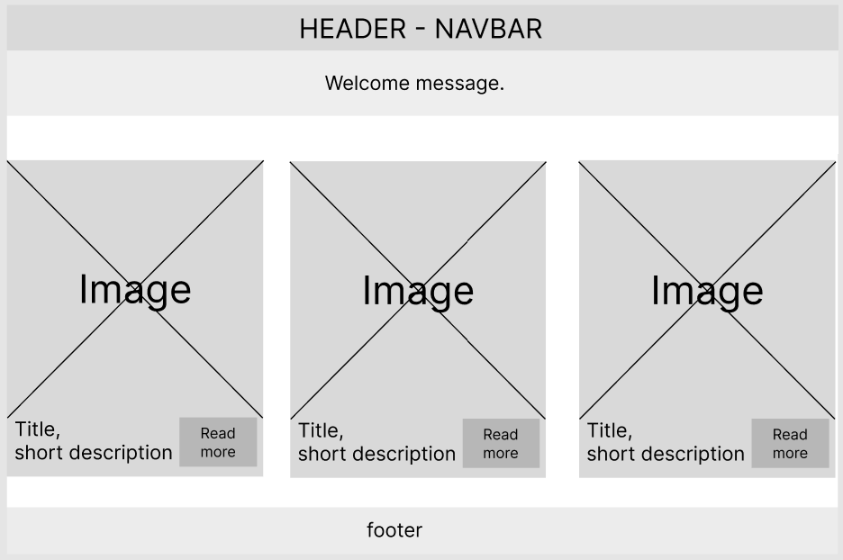
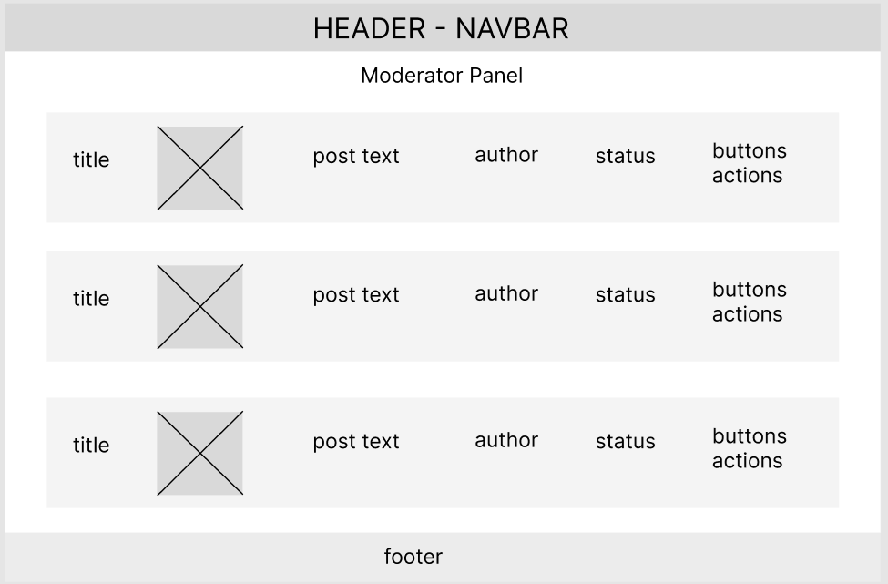
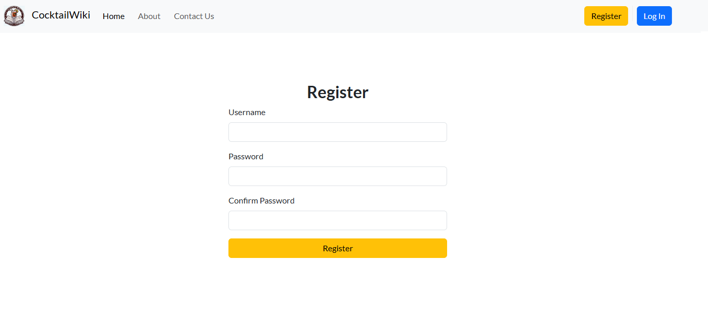

# <div id="up">Cocktail Wiki</div>


### [Live site](https://cocktailwiki-8c2f830d1c00.herokuapp.com/)

## Contents:

- <a href="#ux">UX</a>
  - <a href="#strategy">Strategy</a>
  - <a href="#db">Database structure</a>
  - <a href="#design">Design</a>
- <a href="#testing">Testing</a>
- <a href="#features">Existing Features</a>
- <a href="#f_features">Features left to Implement</a>
- <a href="#technology">Languages, Technologies & Libraries</a>
- <a href="#credits">Credits</a>
- <a href="#deployment">Deployment</a> 

## <div id="ux">UX</div>
### Overview
Cocktail Wiki is a site for lovers of cocktail culture. The main goal is to introduce people to cocktail culture, share various cocktails and your opinion about it.

#### First Time User
- The user can go in and get acquainted with various cocktails and their recipes.
- The user can create his own post describing his favorite cocktail and add an amazing photo.
- The user can share his opinion about certain cocktails in the comments
#### Returning User
- As a regular user can see comments on his posts, as well as the responses of other users to his posts and comments.

### <div id="strategy">Strategy</div>
The goal was to create the most simple and understandable website for the user. This enabled users to log in easily and quickly. Creating posts, comments and feedback forms. Also, the main highlight was the admin panel, where he can “approve” a post from a user, edit or delete it. (CRUD)


### <div id="db">Database structure</div>


When I decided on the idea of the project, I decided that there would be two tables: users and posts. In the future, I decided to add “comments” functionality and combine it with the two current tables. And the last modification was the “messages” table on the “Contact us” page.


### <div id="design">Design</div>

The site design is intuitive and functional. Google Lato font (body) was used to customize default Bootstrap fonts.
The main goal of the site is to provide users with practical and useful information about cocktails and their recipes, with the ability to comment and create their own posts. In this context, targeted efforts have been made, as well as focusing on the opinions required by users.

#### Colours

The following colour palette was used from [Coolors](https://coolors.co/):


The colors are chosen so as not to overload the eyes with bright colors in the design, and so that the first thing the user sees on the site are beautiful and bright photographs of cocktails from the posts. I settled on Bootstrap's standard tones.

#### Wireframes

> index.html



> detail_post.html


> moderator-panel.html



> about.html


> contact_us.html


> register.html



> login.html

 

---

## <div id="testing">Testing</div>

### Manual testing

Thorough testing was conducted by the developer and multiple users among friends and family. Usability suggestions were considered and acted on.
All design features have been manually tested and everything functions as expected. Testing was completed in my local terminal and also in Heroku deployment.

- Testing for responsiveness was conducted using Chrome Dev Tools. The website was tested extensively on a range of emulated mobile, tablet and large format screen sizes in both portrait and landscape orientations.<a href="#responsiveness">(Testing results are here)</a>

- All HTML files were passed through the W3C validator with no errors.
- CSS file (`style.css`) was passed through the W3C validator with no errors.
- The website was tested on browsers Chrome, Firefox, Edge and Opera.
- All user flows were tested, including landing page navigation, link clicks and forms submissions.
- All forms have been tested to ensure they are validated and can be submitted without errors.

The steps and results are as follows.

#### <div id="testing_us">Testing User Stories </div>

| User story                                                                          | User story testing |           
|-------------------------------------------------------------------------------------| ------------- | 
| As a User, I would like to familiarize myself with the information on the home page | On the main page, the user has access to posts, with the opportunity to get the full article.
| As a User I would like to create an account so that I can book an appointment.      | After registering an account, the user independently fills in information to log in to the system in the future. The user can add their username and password during the registration process (Create). || 
| As a registered user, I would like to create my own post.                           | On the post creation page, the user sees a form with three fields: Title, Post Body and the ability to upload a photo.|
| As a registered user, I can go to the post I like and leave a comment.              | Under each post there is a simple comment form for registered users.|
| As an admin, I have an additional admin panel where I have all the list of posts and messages via the "contact us" page.|  This page has buttons such as: publish, cancel, edit and delete a post. It is also possible to delete messages received from the “contact us” form.|

#### <div id="testing_features">Testing Features</div>
##### Navigation links

| Test |  Result |          
| ------------------ | ------------- |
| Non logged in user can access the links of landing page in the navbar.  | A user who is not logged in can access the “Home”, “About”, “Contact Us” sections. All navigation links on the landing page work and lead the user to the desired part of the page. The link to the active page is highlighted in each case.
| Non logged in user can access to sign in and login pages.| The user can click the "Login" button on the right side of the header and will be redirected to the login page.  There is also a "Register" button|
| Logged in user can log out of their profile.| User can click "Logout" button on the navigation bar and  log out of their profile. |


##### User Forms

| Test |  Result |          
| ------------------ | ------------- |
| User can create account. | user can access registration page from "login" page. They are asked to register if they don't already have an account. The registration form has error handling built in so the user must make the correct inputs. If inputs are incorrect the user is shown a message about incorrect data entry. |
| User can log in. | The user is redirected to the login page when they click the "Login" button.  If the username or password is incorrect, the message “Please enter a correct username and password. Note that both fields may be case-sensitive." is displayed to the user.|


#####  Security Tests

| Test |  Result |          
| ------------------ | ------------- |
|Non logged in user cannot create posts. | A user who is not logged in will go to the post creation page and will be redirected to the “login” page. |
|A user who is not logged in cannot read comments on a post. | A user who is not logged in will be shown the number of comments, but the comments themselves will not be accessible; when clicking on the number of comments, the user will be redirected to the “login” page.|


#### <div id="responsiveness">Responsiveness Testing</div>

Testing for responsiveness was conducted using Chrome Dev Tools. The website was tested extensively on a range of emulated mobile, tablet and large format screen sizes in both portrait and landscape orientations.

| Device |  Resolution  |   Result  |        
| ------------------ | ------------- | ------------- |
| Samsung Galaxy S8+|  360 x 740  |   Pass  |
| iPhone 6/7/8 |  375 x 667  |   Pass  |
| iPhone X |  375 x 812  |   Pass  | 
| iPhone 12 PRO |  390 x 844  |   Pass  |
| Samsung Galaxy A51/71 |  412 x 914  |   Pass  |
| iPhone XR |  414 x 896  |   Pass  | 
| iPad Mini |  768 x 1024  |   Pass  | 
| iPad Air |  820 x 1180  |   Pass  | 
| iPad Pro |  1024 x 1366 |   Pass  | 
| HP Laptop 14s |  1920 x 1080|   Pass  | 
 

---

### Google Lighthouse Testing

Site pages have been tested using Lighthouse to identify performance and accessibility issues and ensure best practices are followed.

> Desktop version


> Mobile version


 

### WAVE Web Accessibility Evaluation Tools  (https://wave.webaim.org/)

> WAVE


### HTML W3 Validation 
Result: no errors.

### CSS Validation 
Result: no errors.

### Python Validation
Result: no errors. 
 
 
## <div id="features">Existing Features</div>
### Navigation 

The main navigation is located in the header and is present on all pages (fixed at the top). The hamburger menu is present on medium and small devices and expands to show the main navigation links.
The navigation bar contains the site logo, title, landing page navigation links, and buttons: Home, About Us, Contact Us, Register, and Login.
> Desktop version

> Mobile version

 
A welcome message "Welcome, <username>!" appears for the logged in user. 


## <div id="f_features">Features left to Implement</div>

- Add the ability to put "likes" to a post, based on these ratings build a rating of "most popular posts" and display them at the top of the site.
- Improve the post creation form, divide the post into sections such as: the history of the cocktail, recipe, interesting facts.
- Add a "profile" button, where you can see all created posts and user comments.
- Improve the user registration form, add an email with the ability to confirm registration by email.


## <div id="technology">Languages, Technologies & Libraries</div>
### Languages:
- **Python** is used for the logic in this project.
- **HTML/CSS** + **Django Template Language** is used to structure the web pages.
- **Javascript** is used to paginate posts on the home page.

### Libraries and Frameworks:
- **Django** is used to build this project. It provides a ready-to-use admin panel and includes many template helper tags that make coding fast and efficient.
- **Bootstrap 5** is used as the underlying frontend framework to work alongside Django.
- **htmx** library is used to dynamically fetch and load content using AJAX requests.
- 
### Technologies:
  
- **Heroku** used for hosting the project.
- **GitHub** used to store the code for this project & for the projects Kanban board used to complete it.


## <div id="credits">Credits</div>
- All images are made using AI [Microsoft Bing](https://www.bing.com/images/create).
- [Favicon.io](https://favicon.io/) used to create favicon.
- [Draw.io](https://www.drawio.com/) used to create database diagram.
- ChatGPT (v3.5) - used, after receiving the result was rebuilt and adapted code.
 

## <div id="deployment">Deployment</div>
1. Install the Heroku CLI.
2. Log in to Heroku.
``` 
 heroku login
```
3. Create a Heroku App. Open your terminal and run 
```
heroku create cocktailwiki
```
4. Prepare Static Files in settings.py
```
STATIC_URL = 'static/'
STATIC_ROOT = os.path.join(BASE_DIR, 'staticfiles')
STATICFILES_DIRS = (os.path.join(BASE_DIR, 'main/static'),)
```
Create a requirements.txt
```
pip freeze > requirements.txt
```
5. Deploy Your Application
```
git init
git add .
git commit -m "Init commit"
```
6. Push your code to Heroku.
```
git push heroku master
```
7. Run Migrations
```
heroku run python manage.py migrate
```

##### Cloning the repository:
1. Navigate to https://github.com/TeRRaeB/cocktailwiki
2. Click on the arrow on the green code button at the top of the list of files.
select the clone by https option and copy the URL it provides to the clipboard.
3. Navigate to your code editor of choice and within the terminal change the directory to the location you want to clone the repository to.
4. Type 'git clone' and paste the https link you copied from github.
5. Press enter and git will clone the repository to your local machine. 